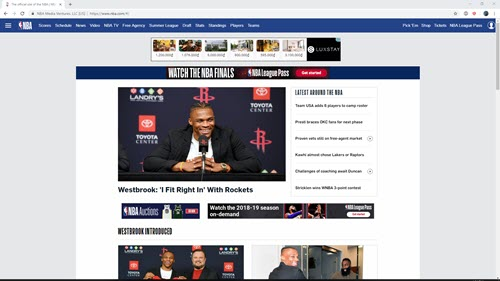
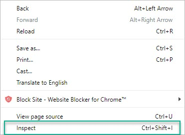
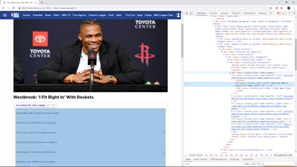
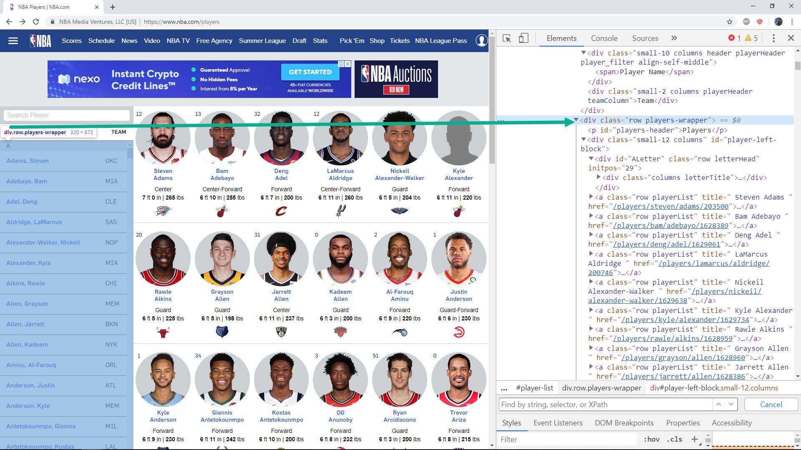
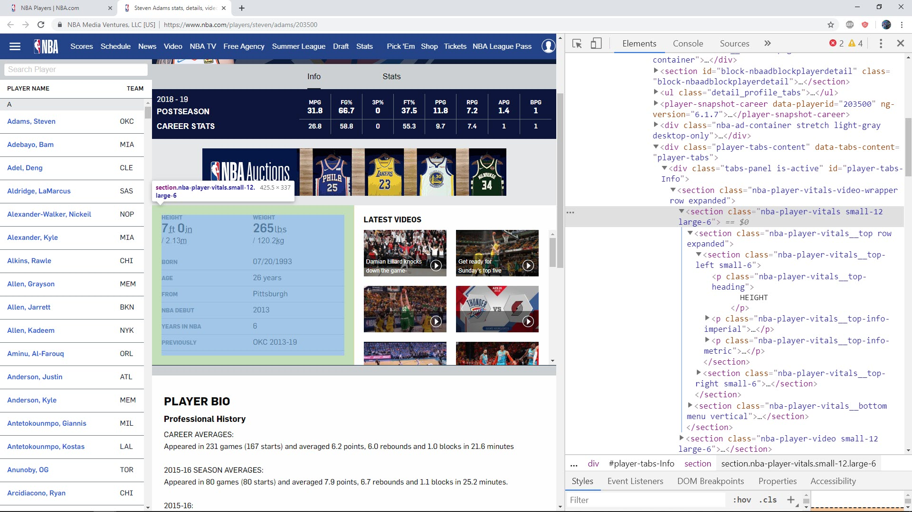

### Inspecting Web Page with Chrome Developer Tool

At step 1, we will go in deep detail how to use `Chrome Developer Tool` to inspect web page.

At end of this chapter you will understand how to do inspecting web page and have clear strategies to scrape data from HTML page.

We will use [NBA](https://www.nba.com/#/) for our demo, let access NBA with Chrome browser.

#### Chrome Developer Tool

We will use `Chrome Developer Tool` to inspect NBA home page. Now mouse over web page then right click, then select `Inspect` from context menu.

A panel will open and show up corespond HTML content of NBA home page. We saw that HTML show on a tree structure and very easy to navigate from tag to tag.

#### Example 1 : Inspect NBA News

Suppose we want to scrape all ***title and link*** inside the box "LATEST AROUND THE NBA".

Move mouse up and down on HTML tree view to findout what web page items is selected when we select corespond tag.

We found that when mouse select `div` tag which has class name `content_list--collection`, the whole news area will be selected. So the first step should be find the `div` tag with class name `content_list--collection`.

Now after know the `div` tag which contain all news, we need continue go to each new inside the box.

Continue try to moving the mouse around, we will see that titles and link are inside `a` tag which have class name `content_list--item clearfix`.

So for conclusion we have following strategy to scrape all new title inside "LATEST AROUND THE NBA"

* Search for `div` tag which has class name `content_list--collection`.
* Inside above `div` tag, search for all `a` tags which have class name `content_list--item clearfix`.

#### Example 2 : Inspect NBA Players

Suppose we want to ***scrape detail data for each players*** on link https://www.nba.com/players.

From web page we see that we want to find out HTML tag which contain all player name. Right click mouse and select `inspect` , then move mouse around we know that we need to find `div` tag with class name `players-wrapper`.

Inside the `div` we found above, we nee do to find all `a` tag with class name `playerList` which contain name and link to detail data for each player.

From link for each player above, we go to detail page, for example we go to detail page for player Steven Adams at reference. In this page, we need to find `div` tag with class name `nba-player-vitals` which contain all detail informations

That it, now let sumary again strategy to get detail information for each players:

* From url https://www.nba.com/players search for `div` tag which has class name `players-wrapper`.
* Inside `div` above, search for all `a` tags which has class name `playerList`.
* Which each `a` tags above, we scrape `href` attribute to have link to detail information for each player.
* Inside each detail url, for example https://www.nba.com/players/steven/adams/203500 we search for `div` tag which has class name `nba-player-vitals` . Inside this `div` tag contain all detail data we need.