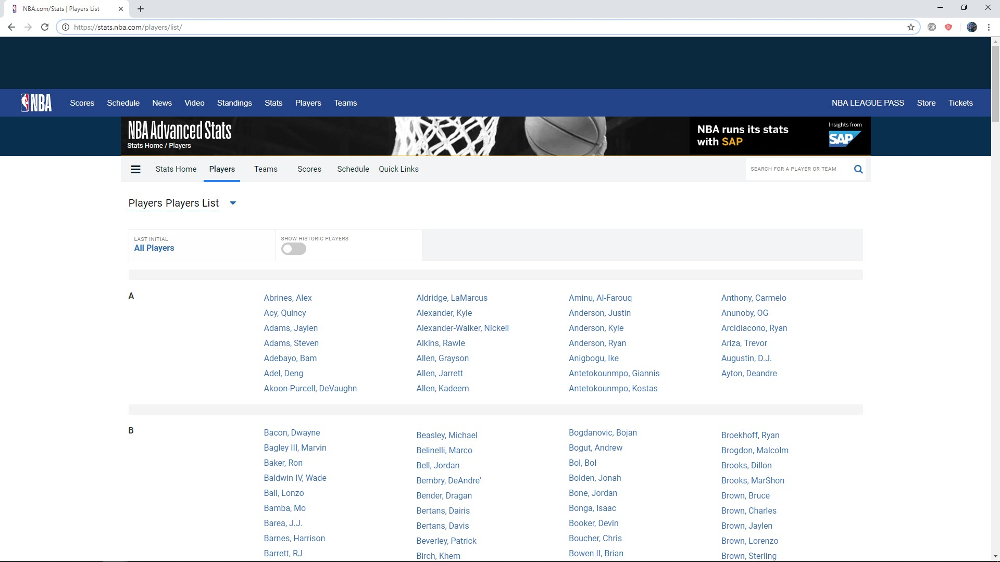
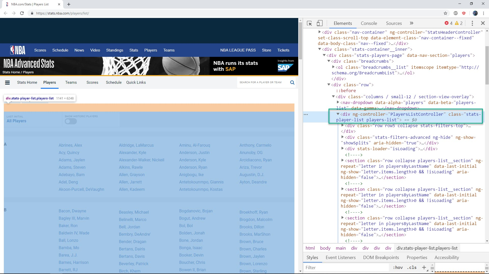
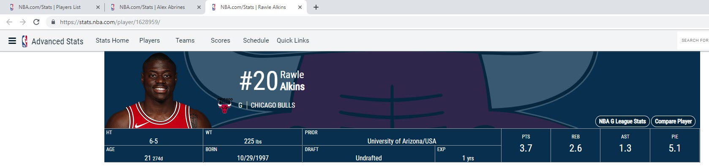

### NBA projects introduction

[NBA](nba.com) is popular site when you want to to find information about men's professional basketball league in North America. In this chapter we will do 4 difference missions to scraping data on this site.

* scrape name of all players

* scrape name and detail link of all players

* scrape detail information of all players

* scrape image of all players

  

#### Mission 1 : scrape name of all active player

Let access url https://stats.nba.com/players/list/ , you will see full list of player order in alphabet list.




Right click and select 'Inspect' you will open chrome developer tool panel


Now move the mouse around and find the tag which contain all names inside it. You will find out that is `div` tag with `class` name is `stats-player-list`



Now mouse over one name and inspect, you will see that it inside `li` tag with class `players-list__name`


So after inspection we have following strategy to scrape all name.

* search for `div` tag with `class` is `stats-player-list`
* search all `li` tags with class `players-list__name` inside above `div` tag
* scrape text inside each `li` tag above

Now let really do it

```python
from selenium import webdriver
from bs4 import BeautifulSoup

driver = webdriver.Chrome(executable_path=r'C:\chromedriver_win32\chromedriver.exe')

url = 'https://stats.nba.com/players/list/'
driver.get(url)

soup = BeautifulSoup(driver.page_source, 'lxml')
div = soup.find('div', class_= 'stats-player-list')

for a in div.find_all('a'):
	print(a.text)

driver.quit()
```

And at out put you will have 638 players

```python
Abrines, Alex
Acy, Quincy
Adams, Jaylen
Adams, Steven
Adebayo, Bam
Adel, Deng
Akoon-Purcell, DeVaughn
Aldridge, LaMarcus
Alexander, Kyle
...
```


#### Mission 2 : scrape name and detail link of all active player (try it your self)

In this mission we scrape name and correspond link to detail information of that player.

Final result should look like

```python
Abrines, Alex
/player/203518/


Acy, Quincy
/player/203112/


Adams, Jaylen
/player/1629121/
```


####  Mission 3 : scrape detail information for each player (try it your self)

When click to detail link, you will know player detail information




In this mission, we will need to scrape detail data for each player like : name, PTS, REB, AST, PIE

The result should be

```python
name :  Abrines, Alex
link :  https://stats.gleague.nba.com/player/203518/
pts :  0.0
reb :  0.0
ast :  0.0
pie :  0.0


name :  Acy, Quincy
link :  https://stats.gleague.nba.com/player/203112/
pts :  21.7
reb :  8.0
ast :  1.3
pie :  12.0
    
...
```

<video width="700" height="500" controls>  
    <source src="images/detail.mp4" type="video/mp4">
</video>


#### Mission 4 : scrape image for all players (try it your self)

Now we want to get image for each player


Result should as following video


<video width="700" height="500" controls>  
    <source src="images/player_image.mp4" type="video/mp4">
</video>