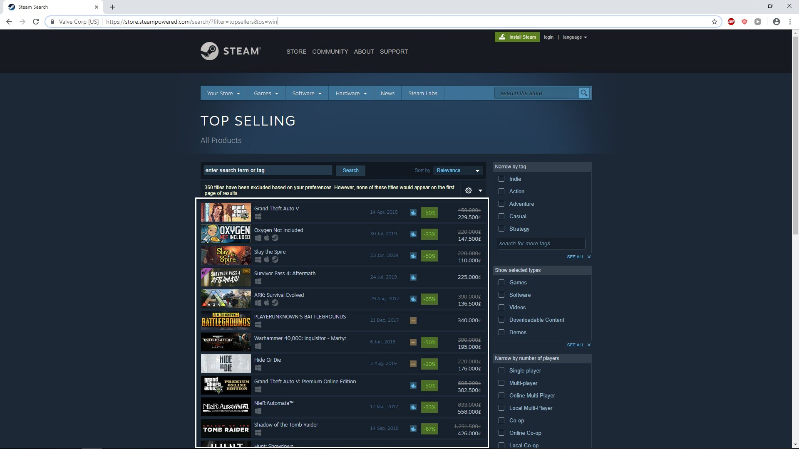
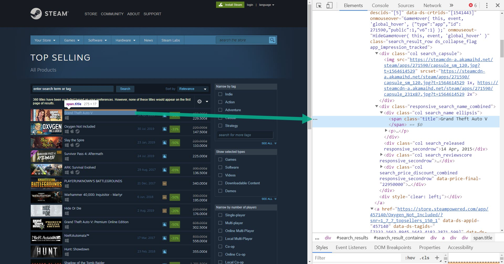
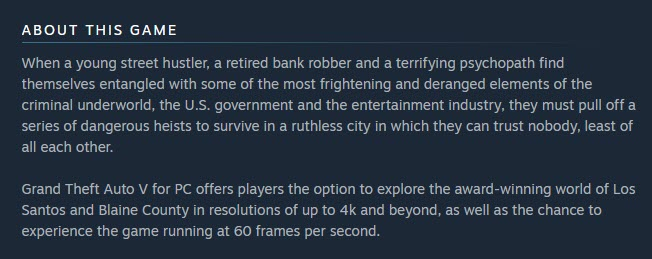
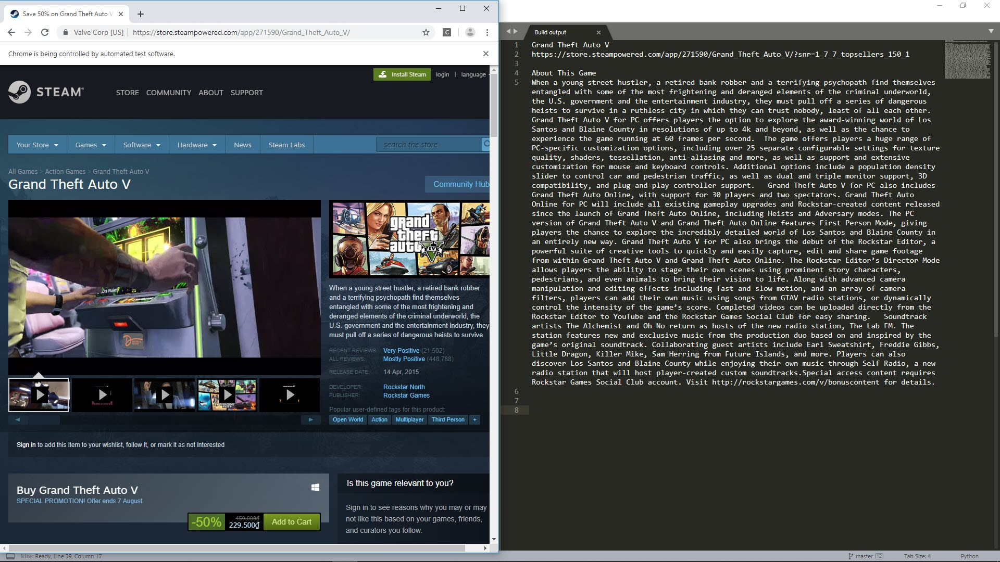

### Steam projects

Steam is a video game digital distribution platform developed by Valve Corporation. We have 2 mission when scrape data from Steam

* Scrape top selling items
* Scrape top selling items with detail information description
* Login to steam before doing scraping

#### Mission 1 : scrape top selling items

Let access [this url](https://store.steampowered.com/search/?filter=topsellers)

We will see a table list out the top seller



Now our job is scrape title and link of top selling at first page.

Let's do some inspecting and we found that `div` contain all top selling items has `id=search_result_container` 


And then each game is inside `a` tag with `class` is `search_result_row`


And inside each game to get the game tile, we need to find for `span` tag with class `title`.

 


That it, now let do the code.

```python
from selenium import webdriver
from bs4 import BeautifulSoup
import requests

driver = webdriver.Chrome(executable_path=r'C:\chromedriver_win32\chromedriver.exe')

def top_seller():
	# search web scraping
	url = 'https://store.steampowered.com/search/?filter=topsellers&os=win'
	driver.get(url)

	soup = BeautifulSoup(driver.page_source, 'lxml')

	# search for div contain all game
	div = soup.find('div', {'id':'search_result_container'})

	# search for a contain one game
	for a in div.find_all('a', class_='search_result_row'):

		# search for title
		span_name = a.find('span', class_='title')
		print(span_name.text)
		print(a['href'])
		print('\n')

top_seller()

driver.close()
```

and when running, we should see result

```python
"""
Grand Theft Auto V
https://store.steampowered.com/app/271590/Grand_Theft_Auto_V/?snr=1_7_7_topsellers_150_1

Oxygen Not Included
https://store.steampowered.com/app/457140/Oxygen_Not_Included/?snr=1_7_7_topsellers_150_1

Slay the Spire
https://store.steampowered.com/app/646570/Slay_the_Spire/?snr=1_7_7_topsellers_150_1
"""
```


#### Mission 2 : scrape top selling items with detail information (try it your self)

Try click to one game item, we will go to detail page. In this page have session to have detail information



Let scrape this section for each game. Please try this your self first

When running your code result should some thing like below video




#### Mission 3 : login to steam before do scraping (try it your self)

In mission 2 you will see from result that some of game require you above age of 18 in order to view description.

To solve this issue we will try to login to steam before doing scraping.

