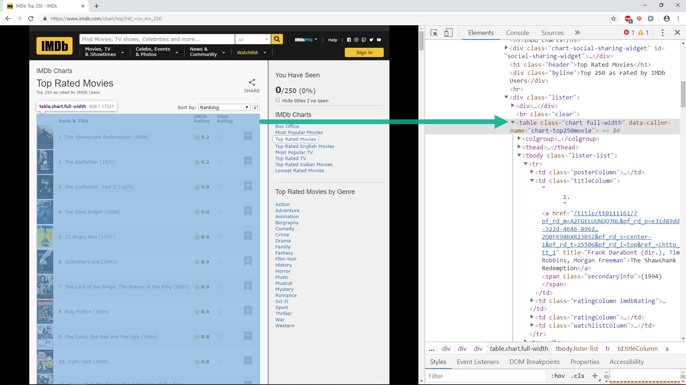
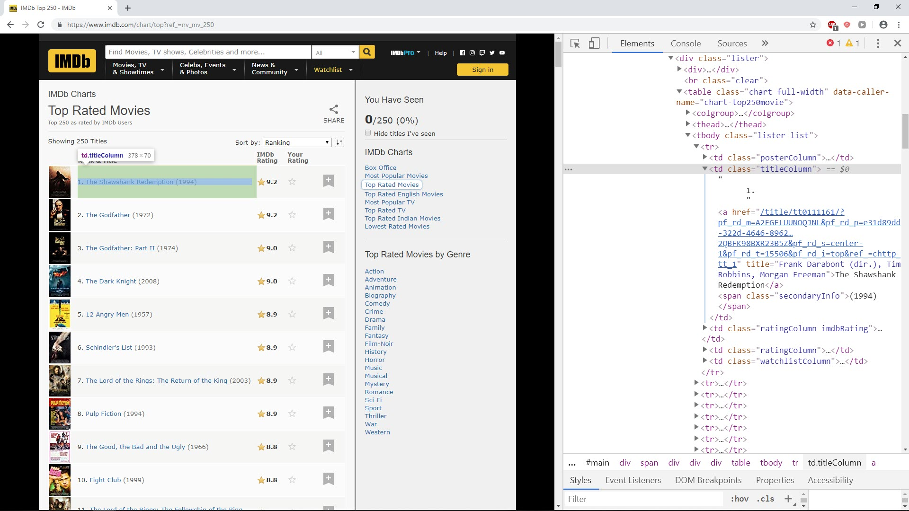

### IMDb projects

IMDb (Internet Movie Database) is an online database of information related to films, television programs, home videos, video games, and streaming content online – including cast, production crew and personal biographies, plot summaries, trivia, fan and critical reviews, and ratings.

We will do following tasks when scrape IMDb site :

* Scrape list of best ever movies
* Scrape best movies with detail information
* Scrape large posters for best movies

#### Mission 1 : scrape list of best ever movies

Access this [url](https://www.imdb.com/chart/top?ref_=nv_mv_250) , a list of 250 best ever movies will show up. In this mission, we will try to scrape all of this movie title.


Let do some inspection, we easy see that entire list is inside `table` tag with class `chart`



And each individual movie is inside `td` tag with class `titleColumn`



So we have following code to scrape all movies title

```python
from bs4 import  BeautifulSoup
from selenium import webdriver

chrome_driver_path = r'C:\chromedriver_win32\chromedriver.exe'
driver = webdriver.Chrome(executable_path=chrome_driver_path)

url = 'https://www.imdb.com/chart/top?ref_=nv_mv_250'
driver.get(url)
soup = BeautifulSoup(driver.page_source,'lxml')

# search for table contain all title
table = soup.find('table', class_ = 'chart')

# search for each individual title
for td in table.find_all('td', class_ = 'titleColumn'):
	
	# get title and clean it up
	print(td.text.strip().replace('\n','').replace('      ',''))
```

And then running above code we will have following result

```python
"""
1.The Shawshank Redemption(1994)
2.The Godfather(1972)
3.The Godfather: Part II(1974)
4.The Dark Knight(2008)
5.12 Angry Men(1957)
6.Schindler's List(1993)
7.The Lord of the Rings: The Return of the King(2003)
8.Pulp Fiction(1994)
9.The Good, the Bad and the Ugly(1966)
10.Fight Club(1999)
"""
```


#### Mission 2 : scrape list of best ever movies with detail infor (try it your self)

From above full title we could extract following information

* Rank
* Movie title
* Year of show
* Link to detail page

Let try your self to scrape all above information. And out put print out should as following

```python
"""
rank   :  1
titele :  The Shawshank Redemption
year   :  1994
link   :  /title/tt0111161/?pf_rd_m=A2FGELUUNOQJNL&pf_rd_p=e31d89dd-322d-4646-8962-327b42fe94b1&pf_rd_r=5J8K5RAZ3N1Q80SH0JMQ&pf_rd_s=center-1&pf_rd_t=15506&pf_rd_i=top&ref_=chttp_tt_1


rank   :  2
titele :  The Godfather
year   :  1972
link   :  /title/tt0068646/?pf_rd_m=A2FGELUUNOQJNL&pf_rd_p=e31d89dd-322d-4646-8962-327b42fe94b1&pf_rd_r=5J8K5RAZ3N1Q80SH0JMQ&pf_rd_s=center-1&pf_rd_t=15506&pf_rd_i=top&ref_=chttp_tt_2
"""
```


#### Mission 3 : Scrape large poster for all movies (try it your self)

With each individual movie, when click to detail link, detail page will show up. In detail page contain large poster that we want to scrape in this mission.


Let's try your self to scrape these posters, it will be very interesting. Result should as below

<video width="700" height="500" controls>  
    <source src="images/poster.mp4" type="video/mp4">
</video>

