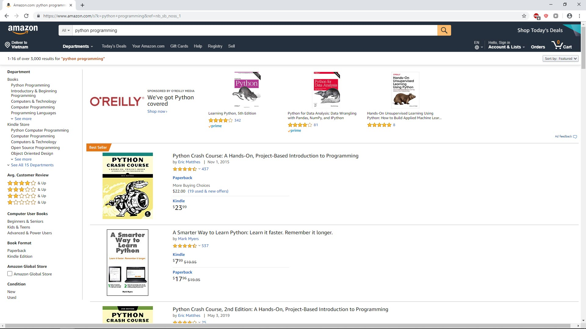
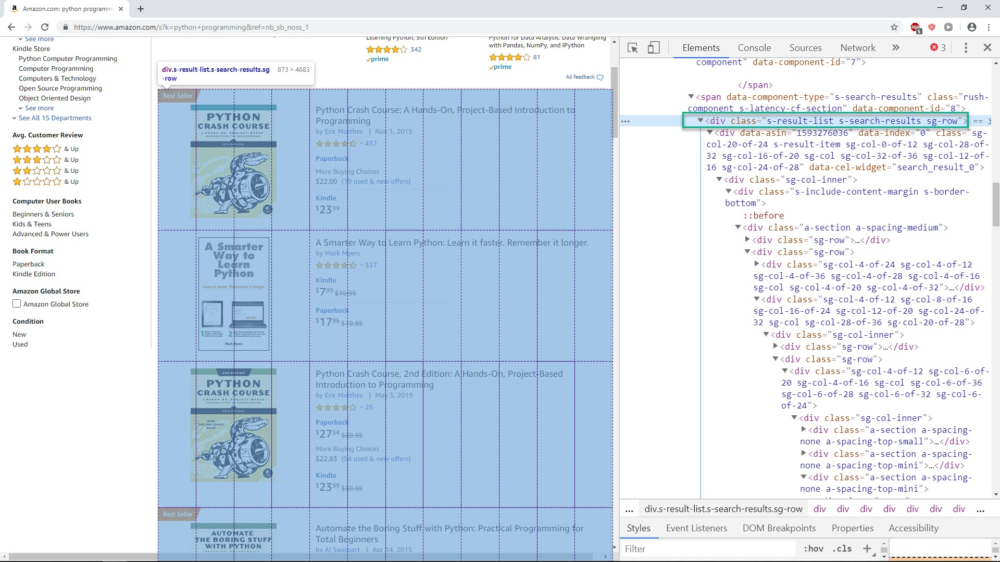
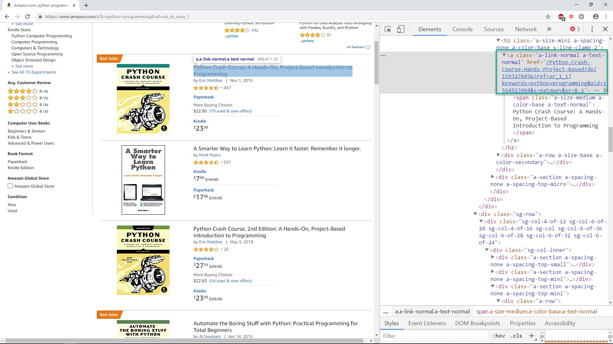
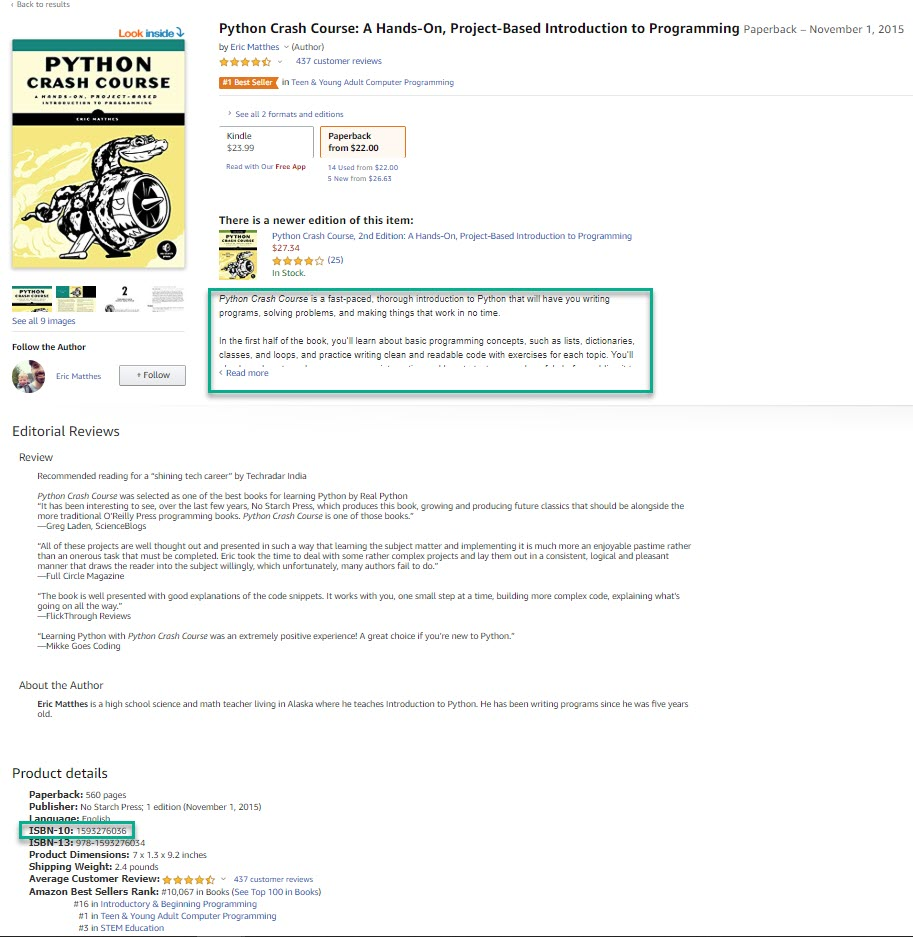
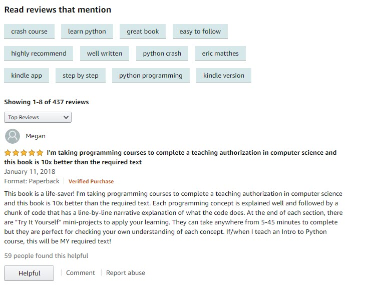

### Amazon projects

Amazon is largest ecommerce site in the world. We will do following web scraping task on Amazon:

* Scrape book list "python programming", get book title and link to detail page.
* Scrape detail information for each book in side "python programming" list
* Scrape customer comment for each book inside "python programming" list
* Scrape search result from multiple pages

#### Mission 1 : scrape title and detail link

Access the [link](https://www.amazon.com/s/ref=nb_sb_noss_1?url=search-alias%3Daps&field-keywords=python+programming) and you will see a list of python programming book




Let do some inspection on this page, we see that `div` with class `s-result-list` contain all books




Now to acess each book, we see that `a` tag with class `a-link-normal a-text-normal` contain book title and link to detail for each book




So we have following code to scrape book title and link to detail page

```python
from bs4 import BeautifulSoup
from selenium import webdriver

chrome_driver_path = r'C:\chromedriver_win32\chromedriver.exe'
driver = webdriver.Chrome(executable_path=chrome_driver_path)

def get_book_list():
	url = 'https://www.amazon.com/s/ref=nb_sb_noss_1?url=search-alias%3Daps&field-keywords=python+programming'
	driver.get(url)

	soup = BeautifulSoup(driver.page_source, 'lxml')
	div = soup.find('div', class_='s-result-list')

	for a in div.find_all('a', class_ = 'a-link-normal a-text-normal'):
		print('title : ',a.text.replace('\n', ''))
		print('link : ', a['href'])
		print('\n')
		print('\n')

get_book_list()

driver.close()
```

After running we will have book title and link print out as below

```python
"""
title :  Python Crash Course: A Hands-On, Project-Based Introduction to Programming
link :  /Python-Crash-Course-Hands-Project-Based/dp/1593276036/ref=sr_1_1?keywords=python+programming&qid=1564924835&s=gateway&sr=8-1

title :  A Smarter Way to Learn Python: Learn it faster. Remember it longer.
link :  /Smarter-Way-Learn-Python-Remember-ebook/dp/B077Z55G3B/ref=sr_1_2?keywords=python+programming&qid=1564924835&s=gateway&sr=8-2

title :  Python Crash Course, 2nd Edition: A Hands-On, Project-Based Introduction to Programming
link :  /Python-Crash-Course-2nd-Edition/dp/1593279280/ref=sr_1_3?keywords=python+programming&qid=1564924835&s=gateway&sr=8-3
"""
```


#### Mission 2 : scrape detail infor for each book (try it your self)

When click to each book, We will go to detail page, in this page for example we want to scrape for ISBN number and the book description.




When running your code, console result should as below

```python
"""
isbn :   1593276036
description :  Python Crash Course is a fast-paced, thorough introduction to Python that will 
have you writing programs, solving problems, and making things that work in no 
time.In the first half of the book, you’ll learn about basic programming 
concepts, such as lists, dictionaries, classes, and loops, and practice 
writing clean and readable code with exercises for each topic. You’ll also 
learn how to make your programs interactive and how to test your code safely 
before adding it to a project. In the second half of the book, you’ll put your 
new knowledge into practice with three substantial projects: a Space 
Invaders–inspired arcade game, data visualizations with Python’s super-handy 
libraries, and a simple web app you can deploy online.As you work through 
Python Crash Course you’ll learn how to:–Use powerful Python libraries and 
tools, including matplotlib, NumPy, and Pygal–Make 2D games that respond to 
keypresses and mouse clicks, and that grow more difficult as the game 
progresses–Work with data to generate interactive visualizations–Create and 
customize Web apps and deploy them safely online–Deal with mistakes and errors 
so you can solve your own programming problemsIf you’ve been thinking 
seriously about digging into programming, Python Crash Course will get you up 
to speed and have you writing real programs fast. Why wait any longer? Start 
your engines and code!Uses Python 2 and 3
"""
```


#### Mission 3 : scrape customer comment for each book (try it your self)

In this mission, we also scrape inside detail page, but we want to get comment from reader. Just the most valueable comment. It is the top comment.




When running your code it should print out as below

```python
"""
comment :  This book is a life-saver! I'm taking programming courses to complete a 
teaching authorization in computer science and this book is 10x better than 
the required text. Each programming concept is explained well and followed by 
a chunk of code that has a line-by-line narrative explanation of what the code 
does. At the end of each section, there are "Try It Yourself" mini-projects to 
apply your learning. They can take anywhere from 5-45 minutes to complete but 
they are perfect for checking your own understanding of each concept. If/when 
I teach an Intro to Python course, this will be MY required text!
"""
```


#### Mission 4 : scrape book from multiple pages (try it your self)

We could see that search result for "python programming" contain multiple pages (here we see that have 20 pages).

In this mission we will try to get book infor from all pages

 